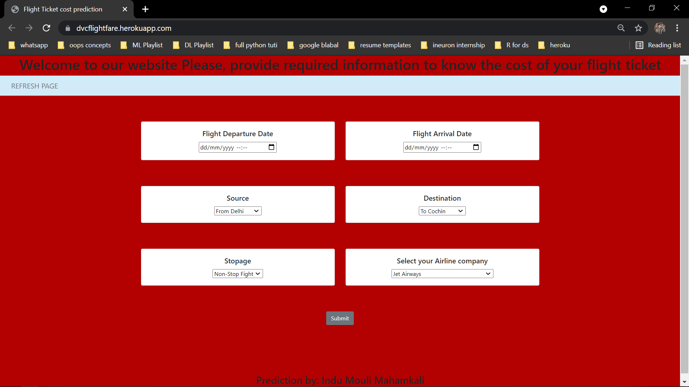

# dvc flightfare implementation

## Intention of this implementation:

The main intention for creating this project is to acquire the knowledge of real time ml project implementation with modular coding standards. Hence, used DVC (data version control) for MLOps and CI/CD pipeline to deploy the model, so that we can keep track of the entire project as stages. 

## Problem Statement:

This project is all about creating an machine learning algorithm, that helps the user to know their flight journey cost by providing the required input. 

Although the data provided resembles the real time data, but if we can add the advantages of real time data like flight and seats availability, weather, country wise transportation charges we can increase the accuracy of prediction upto 20%-22%. And can make a significant impact on flight bookings. 

## Approach

As the main goal is to predict the fares of the flights based on different factors available in the dataset.

<pre> 
<li> Data Exploration     : I started exploring dataset using pandas,numpy,matplotlib and seaborn. </li>
<li> Data visualization   : Plotted graphs to get insights about dependent and independent variables. </li>
<li> Feature Engineering  :  Removed missing values and created new features as per insights.</li>
<li> Model Selection I    :  1. Tested all base models to check the base accuracy.
                             2. Also plotted residual plot to check whether a model is a good fit or not.</li>
<li> Model Selection II   :  Performed Hyperparameter tuning using gridsearchCV and randomizedSearchCV.</li>
<li> Pickle File          :  Selected model as per best accuracy and created pickle file using joblib .</li>
<li> Webpage & deployment :  Created a webform that takes all the necessary inputs from user and shows output.
                                And deployed the project on heroku</li></pre>

## Deployment Link

 Link Heroku : https://dvcflightfare.herokuapp.com/ 

## UserInterface

## Technologies Used
<pre> 
1. Python 
2. Sklearn
3. Flask
4. Html
5. Css
6. Pandas, Numpy 
7. Database (Cassandra)

</pre>
